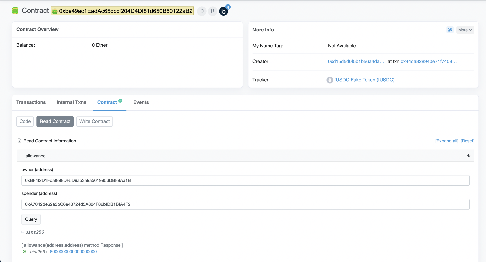

# learn etherspot by examples
* sample examples are git cloned from https://github.com/pillarwallet/etherspot-sdk-examples.git

## transfer ethers
* refer to: 03-submit-eth-transaction.ts

### build & run
```
yarn
```
```
yarn 03-transfer-eths
```
> make sure you have to fund enough ETHs in your "Smart Wallet Contract" respective to your sdk (key) account, where is 
[0xbf4f2d1fdaf898df5d9a53a9a5019856db88aa1b](
https://ropsten.etherscan.io/address/0xbf4f2d1fdaf898df5d9a53a9a5019856db88aa1b)

> check with the balance of your receiver account. https://ropsten.etherscan.io/address/0x940d89BFAB20d0eFd076399b6954cCc42Acd8e15#internaltx

## transfer tokens
* refer to: 04-submit-token-transaction.ts 
after batch complete, you can check your allownce for receiver on etherscan as follow;

> make sure you have to fund enough Tokens in your "Smart Wallet Contract" respective to your sdk (key) account, where is 0xbf4f2d1fdaf898df5d9a53a9a5019856db88aa1b

> actually this batch tranfer is powerful when you need to transfer token or ETHs to many recipients at a time in one smart contract call.


### build & run
```
yarn
```
```
yarn 04-transfer-tokens
```



# Q&A
## if you are not create sdk corretly, you may see the following wierd error messages
```
~/src/ts-node-etherspot(main*) » yarn start                                                              mingderwang@MingderdeMBP
yarn run v1.22.10
$ ts-node main.ts

<--- Last few GCs --->

[35958:0x138008000]     1398 ms: Scavenge 93.3 (111.0) -> 84.8 (115.5) MB, 1.5 / 0.0 ms  (average mu = 1.000, current mu = 1.000) allocation failure
[35958:0x138008000]     1584 ms: Scavenge 99.4 (116.8) -> 89.0 (120.2) MB, 1.1 / 0.0 ms  (average mu = 1.000, current mu = 1.000) allocation failure
[35958:0x138008000]     1778 ms: Scavenge 106.4 (123.9) -> 97.2 (126.9) MB, 1.7 / 0.0 ms  (average mu = 1.000, current mu = 1.000) allocation failure
..
...
24: 0x104ba2524 Builtins_ConstructHandler [/Users/mingderwang/.nvm/versions/node/v12.22.5/bin/node]
25: 0x104abe840 Builtins_InterpreterEntryTrampoline [/Users/mingderwang/.nvm/versions/node/v12.22.5/bin/node]
26: 0x104abe840 Builtins_InterpreterEntryTrampoline [/Users/mingderwang/.nvm/versions/node/v12.22.5/bin/node]
27: 0x104ab6d08 Builtins_ArgumentsAdaptorTrampoline [/Users/mingderwang/.nvm/versions/node/v12.22.5/bin/node]
# learn etherspot by examples

```

## ReferenceError: window is not defined
> Metamask is not support the code in CLI, you can see example in 05-submit-eth-transactions-with-metamask.ts, it's fail.
